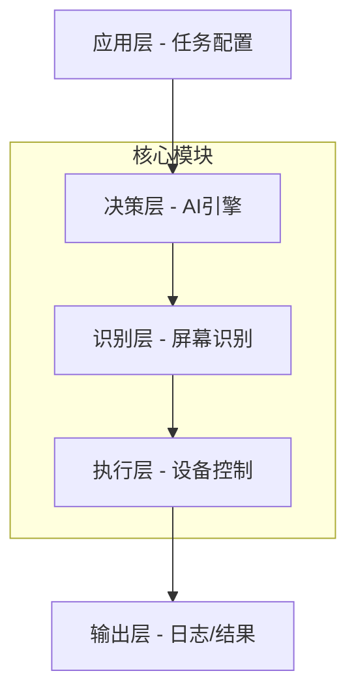

## 产品概述

一个基于Python的AI自动化操作系统,能够通过模拟鼠标和键盘操作来完成用户指定的任务。系统结合AI识别能力和操作执行能力,实现智能化的自动化流程。

## 核心功能

- 鼠标操作模拟:移动、点击、拖拽、滚轮等基本鼠标操作
- 键盘操作模拟:文本输入、快捷键组合、特殊按键等
- 屏幕识别:AI识别屏幕内容、元素定位、文字识别
- 任务编排:支持多步骤任务定义和执行
- 配置管理:操作参数配置和任务脚本管理

## 技术栈

- **核心语言**: Python 3.8+
- **鼠标键盘模拟**: pyautogui / pynput
- **屏幕识别**: pyautogui (图像定位) + pytesseract (OCR) / easyocr
- **AI集成**: OpenAI API / 本地模型支持(可选)
- **任务编排**: 自定义任务引擎
- **配置管理**: YAML/JSON
- **日志系统**: logging

## 技术架构

### 系统架构

采用模块化分层架构,分为执行层、识别层、决策层和应用层:



### 模块划分

- **执行层模块**: 负责鼠标、键盘的实际操作控制
- **识别层模块**: 屏幕截图、图像匹配、OCR文字识别
- **决策层模块**: AI决策引擎,根据识别结果选择操作步骤
- **任务引擎模块**: 任务解析、步骤编排、执行控制
- **配置管理模块**: 参数配置、任务脚本加载
- **日志记录模块**: 操作日志、错误追踪、调试信息

### 数据流

任务定义 → 任务解析 → 屏幕识别 → AI决策 → 操作执行 → 结果记录

## 实现细节

### 核心目录结构

```
d:/WorkSpace/python/use_calude_auto/
├── src/
│   ├── controllers/
│   │   ├── mouse_controller.py      # [NEW] 鼠标操作控制器。封装鼠标移动、点击、拖拽、滚轮等操作,提供统一的操作接口
│   │   └── keyboard_controller.py   # [NEW] 键盘操作控制器。封装键盘输入、组合键、特殊按键等操作
│   ├── recognizers/
│   │   ├── screen_capture.py        # [NEW] 屏幕截图模块。负责屏幕捕获、区域截图、图像保存
│   │   ├── image_matcher.py         # [NEW] 图像匹配模块。基于模板匹配定位屏幕元素,支持相似度阈值配置
│   │   └── ocr_recognizer.py        # [NEW] OCR识别模块。文字识别功能,支持tesseract和easyocr
│   ├── ai_engine/
│   │   ├── decision_engine.py       # [NEW] AI决策引擎。根据识别结果和任务上下文生成操作指令
│   │   └── ai_client.py             # [NEW] AI客户端。封装OpenAI API调用,支持本地模型切换
│   ├── task_engine/
│   │   ├── task_parser.py           # [NEW] 任务解析器。解析YAML/JSON任务配置,构建执行计划
│   │   ├── task_executor.py         # [NEW] 任务执行器。管理任务生命周期,执行步骤序列
│   │   └── step_runner.py           # [NEW] 步骤执行器。执行单个任务步骤,处理重试和超时
│   ├── config/
│   │   ├── config_loader.py         # [NEW] 配置加载器。加载和管理配置文件
│   │   └── task_templates/          # [NEW] 任务模板目录。存放预定义的任务模板
│   ├── utils/
│   │   ├── logger.py                # [NEW] 日志工具。统一的日志记录接口
│   │   └── retry.py                 # [NEW] 重试工具。操作重试和超时控制
│   └── main.py                      # [NEW] 程序入口。CLI命令解析和程序启动
├── config/
│   ├── config.yaml                  # [NEW] 主配置文件。系统参数配置
│   └── tasks/                       # [NEW] 任务目录。存放用户定义的任务脚本
├── tests/
│   ├── test_controllers.py          # [NEW] 控制器单元测试
│   ├── test_recognizers.py          # [NEW] 识别模块测试
│   └── test_engine.py               # [NEW] 任务引擎测试
├── requirements.txt                  # [NEW] 项目依赖
├── README.md                        # [NEW] 项目文档
└── setup.py                         # [NEW] 安装脚本
```

## 关键实现说明

### 操作控制层

- 使用pyautogui作为底层库,提供跨平台支持
- 实现防误触机制(移动到屏幕角落紧急停止)
- 操作前后加入安全延迟,避免操作过快
- 支持相对坐标和绝对坐标两种模式

### 屏幕识别层

- 图像匹配使用OpenCV模板匹配算法
- 支持多尺度匹配和相似度阈值配置
- OCR识别支持中英文,可配置识别区域
- 提供识别结果缓存机制,避免重复识别

### AI决策层

- 采用链式提示策略,逐步分解复杂任务
- 支持上下文记忆,维护操作历史
- 提供决策置信度评估,低置信度时人工确认
- 支持自定义决策规则和插件扩展

### 任务执行引擎

- 任务使用YAML配置,易于编辑和维护
- 支持步骤依赖关系和条件跳转
- 实现步骤级别的重试和错误处理
- 支持任务断点续执行

## 设计风格

本项目是一个后端自动化工具,主要交互方式为命令行(CLI)和配置文件。设计重点在于代码结构的清晰性和配置文件的易用性,而非视觉UI设计。

## CLI界面设计

- 简洁的命令行参数解析
- 清晰的进度显示和状态反馈
- 彩色输出提升可读性(成功/失败/警告)
- 详细的日志信息用于调试

## 配置文件设计

- YAML格式,易于阅读和编辑
- 完整的配置示例和注释说明
- 任务模板复用机制
- 参数验证和默认值设置

## Agent Extensions

本任务不使用任何Agent Extensions。项目从零开始创建,直接通过Python代码实现所有功能。